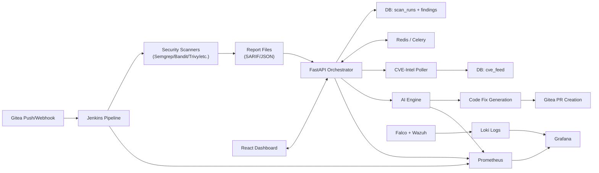
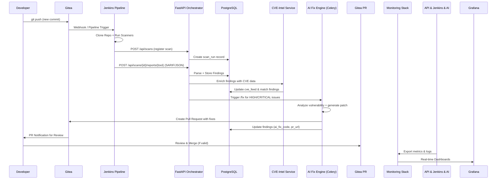

# VigilentOps 

> **Automated Vulnerability Management and DevSecOps Platform**

VigilentOps  is a fully self-hosted and automated vulnerability management platform. It continuously scans source code for security issues, correlates findings with real-world CVE intelligence, applies AI-powered automated remediation, and provides comprehensive monitoring and observability. Human interaction is streamlined exclusively to reviewing and approving the AI-generated pull requests.


##  Project Overview

The platform automates the entire security lifecycle for software products in a secure, self-hosted environment:

1. **Trigger:** A developer pushes code to a self-hosted Gitea instance, which triggers a Jenkins pipeline via webhooks.
2. **Scanning:** Jenkins executes Software Composition Analysis (SCA), Static Application Security Testing (SAST), and Dynamic Application Security Testing (DAST) tools (such as Semgrep, Bandit, Trivy, and Gitleaks) on the cloned repository.
3. **CVE Correlation:** Security findings are automatically matched against a live CVE intelligence feed.
4. **AI Remediation:** High and critical vulnerabilities are sent to an AI engine (utilizing models like NVIDIA NIM) to generate code fixes based on official patches and best practices.
5. **Pull Requests:** The AI engine automatically opens Pull Requests in the developer's Gitea repository complete with code fixes, CVE details, and remediation notes for developer review and merging.
6. **Observability:** Prometheus scrapes real-time metrics; Grafana visualizes security dashboards. Additional runtime monitoring is provided by Falco, Wazuh (HIDS), Loki/Promtail (logs), and cAdvisor.

### Key Benefits
* **Fully Self-Hosted:** Maintain complete control over your code, security data, and infrastructure.
* **Automated Detection + AI Fixing:** Reduces mean-time-to-remediation (MTTR) by automatically generating code patches for critical issues.
* **End-to-End Visibility:** Comprehensive monitoring of code posture, container security, and runtime threats.
* **Seamless CI/CD Integration:** Native integration with Gitea webhooks and Jenkins pipelines.

### Tech Stack & Languages
* **Languages:** Python (~56%), JavaScript (~22%), Go Template, Shell, Groovy, Dockerfile, HTML.
* **Infrastructure:** Docker Compose, custom bridge network (`sg-net`).
* **Database & Queue:** PostgreSQL (with automated schema initialization), Redis (Celery background tasks).
* **Security Scanners:** Semgrep, Bandit, Trivy, Gitleaks, Falco, Wazuh.


## Component Data Flow


## End-to-End Workflow




##  Architecture & Components

The system is orchestrated using Docker Compose. All services operate within a dedicated custom bridge network (`sg-net`).

### Core Services

| Service | Description | Key Ports | Tech / Notes |
| :--- | :--- | :--- | :--- |
| **Gitea** | Self-hosted Git repository & webhooks | `3000` (Web), `2222` (SSH) | Postgres-backed |
| **Gitea Runner** | Executes Gitea CI/CD actions and jobs | — | Docker socket mounted |
| **Jenkins** | Orchestrates scanning pipelines | `8081` (Web), `50000` (Agents) | Custom Dockerfile, Configuration-as-Code (CASC) |
| **PostgreSQL** | Central database for scans, findings, and CVEs | — | Automated init scripts for schema (`init.sql`) |
| **Redis** | Job queue for asynchronous tasks | — | Powers Celery workers |
| **Orchestrator** | Main API for webhooks, scan registration, & reports | `8000` | Python / FastAPI, Prometheus metrics exporter |
| **Celery Worker** | Background AI fix task runner | — | Processes automated remediation tasks |
| **CVE-Intel Poller**| Fetches and stores latest CVE data | `8001` | Periodic updates to CVE database |
| **Dashboard** | Modern React frontend for visibility | `3001` | Connects directly to Orchestrator API |
| **Prometheus & Grafana**| Metrics collection and visualization dashboards | `9090` / `3002` | Pre-provisioned configuration files |
| **Falco + Exporter** | Runtime threat detection and monitoring | — | Kernel & container-level monitoring |
| **Wazuh** | Host Intrusion Detection System (HIDS) | Various | Configured with secure proxy |
| **Loki + Promtail** | Centralized log aggregation | `3100` | Aggregates system and Wazuh security alerts |


##  Database Schema (`init.sql`)

* `scan_runs`: Tracks pipeline executions (repository, commit hash, status, severity counts).
* `findings`: Detailed vulnerability records (SARIF/Bandit parsed, linked to specific scan runs).
* `cve_feed`: Cached CVE intelligence data (NVD details, severity ratings, KEV flags).
* `alerts`: Notification tracking and alerting history.
* *Optimized Indexes:* Built-in indexes ensure rapid query performance for recent scans and severity lookups.


##  Key Modules & Workflows

### 1. Scanning & Pipelines (`jenkins/`, `scanners/`)
* Jenkins pipelines (`jenkins/pipelines/`) clone target repositories and execute security tools:
  * **Semgrep** (utilizing custom rules located in `scanners/semgrep-rules`).
  * **Bandit** (Python SAST analysis).
  * **Trivy** & **Gitleaks** (Container, dependency, and secret scanning).
* Reports (in SARIF/JSON formats) are uploaded to the Orchestrator API endpoint (`/api/scans/{id}/reports/{tool}`).
* The engine parses findings, applies severity mappings, and extracts relevant code snippets.

### 2. AI Engine (`ai-engine/`)
* **Core Files:** `main.py` (FastAPI), `fix_engine.py`, `ai_fix.py`, `nvd_client.py`, `tasks.py` (Celery), `db.py`.
* **Workflow:**
  1. Enriches findings with live CVE data via `/api/scans/{id}/enrich`.
  2. Triggers automated fixes via `/api/scans/{id}/fix` (filters for high/critical issues).
  3. AI model generates secure code patches.
  4. Automatically opens a Gitea Pull Request containing details, CVE references, and remediation notes.
* **Powered by:** NVIDIA NIM or compatible LLM endpoints for deep code comprehension and patching.

### 3. CVE Intelligence (`cve-intel/`)
* Poller service periodically fetches the latest vulnerability disclosures (NVD, etc.) and populates the `cve_feed` table.
* Ensures accurate severity matching and up-to-date remediation guidance.

### 4. Dashboard (`dashboard/`)
* React application (`src/`, `public/`).
* Provides a centralized UI for viewing scan history, active security findings, performance metrics, and embedded Grafana panels.

### 5. Monitoring & Observability (`monitoring/`)
* Prometheus configurations and auto-provisioned Grafana dashboards.
* Falco security rules, Wazuh configurations, and cAdvisor container resource telemetry.


##  Setup & Installation

### Option A: Recommended Installation on Kali Linux (`setup-kali.sh`)
1. Clone the repository and navigate to the project root.
2. Execute the setup script to install Docker, Python tools (Semgrep, Bandit), Trivy, Gitleaks, and pull required container images:
   ```bash
   bash setup-kali.sh
   ```
3. Configure your environment variables in the `.env` file (PostgreSQL credentials, webhook secrets, AI/CVE API keys).
4. Launch the platform using Docker Compose:
   ```bash
   docker compose up -d
   ```

### Option B: Manual Installation
1. Clone the repository:
   ```bash
   git clone https://github.com/your-org/vigilentops.git
   cd vigilentops
   ```
2. Copy and configure your `.env` file with proper database credentials and API keys.
3. Initialize the database schema using `init.sql`.
4. Spin up the containers:
   ```bash
   docker compose up -d
   ```
5. Configure Gitea webhooks to point to your Orchestrator API endpoint for real-time CI triggers.


##  Usage & Integration

* **Developers:** Simply push code changes to your Gitea repository. This triggers automated security scans and potential AI-powered fix Pull Requests.
* **Security Engineers:** Review automated PRs, investigate deep vulnerability insights, and monitor system health via Grafana dashboards.
* **API Consumers:** Access interactive API documentation at `/docs` (provided by FastAPI) for custom tooling integrations.
* **Webhooks:** Gitea webhooks ensure real-time event-driven triggers to the Orchestrator service.


