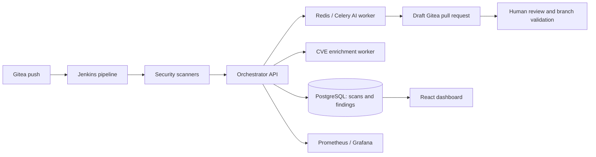

# VigilentOps

VigilentOps (called SecureGuard in several service names) is a self-hosted security scanning lab. Gitea stores the target repository, Jenkins runs scanners, a FastAPI service stores findings in PostgreSQL, and a Celery worker can propose Python fixes as **draft pull requests**. People must review and test those proposals before merging them.

This is a lab reference implementation. Several management ports are published by Docker Compose; restrict access to a trusted network. AI-generated code is a proposal, not a verified remediation.

## How it works

```mermaid
flowchart LR
    G[Gitea push] --> J[Jenkins pipeline]
    J --> S[Security scanners]
    S --> A[Orchestrator API]
    A --> P[(PostgreSQL: scans and findings)]
    A --> C[CVE enrichment worker]
    A --> R[Redis / Celery AI worker]
    R --> D[Draft Gitea pull request]
    P --> U[React dashboard]
    A --> M[Prometheus / Grafana]
    D --> H[Human review and branch validation]
```

1. A Gitea push to `main`, `develop`, or `master` triggers the Jenkins Generic Webhook Trigger job.
2. Jenkins checks out the pushed repository, verifies its commit, registers the scan, and runs its scanner stages. Before upload, it checks that required reports exist and have the expected format; an upload error fails the build. Optional scanners can still be skipped, and a valid report can contain zero findings.
3. The orchestrator parses supported SARIF reports and Bandit JSON into findings. Dockle image-configuration results now use SARIF; Syft's SPDX SBOM is inventory only. The CVE service queues enrichment separately.
4. The AI worker considers **open, medium or higher Python SAST findings**. It groups them by source file, asks a configured model for whole-file changes, checks basic syntax and change size, and opens one `WIP:` Gitea PR when files changed. It posts every stored finding from that scan, across all tools, as numbered comments in the PR conversation. Raw source snippets and descriptions likely to contain credentials are omitted to avoid republishing secrets. Those checks do not establish security or runtime correctness.
5. A reviewer checks the diff against the original finding, runs relevant checks on the PR branch, and merges only after approval. The Jenkins build on the base branch does not validate a later AI PR.

See [Architecture](docs/ARCHITECTURE.md) for the service map, repository layout, and API flow. See [AI pull request review](docs/AI_PR_REVIEW.md) for the review procedure and [Operations](docs/OPERATIONS.md) for backup and response planning.

## Repository map

| Path | Purpose |
| --- | --- |
| `ai-engine/` | FastAPI orchestrator, report parsers, database migrations, Celery AI worker, notifications |
| `cve-intel/` | CVE enrichment API and worker |
| `jenkins/pipelines/` | Jenkins scanner pipeline |
| `scanners/` | Custom Semgrep rules |
| `dashboard/` | React UI served by Nginx; `/api` proxies to the orchestrator |
| `monitoring/` | Prometheus, Grafana, Falco, Wazuh, Loki, and Promtail configuration |
| `wazuh-proxy/` | Internal Wazuh API proxy used by Grafana |
| `scripts/` | Host setup script |
| `tests/` | Python tests for parsing, API import, and remediation safeguards |
| `docs/` | Deployment, architecture, validation, and review guides |

## Run on the lab server

Use a Linux host with Docker Engine and Compose v2. Configuration and startup steps are in [Deployment](docs/DEPLOYMENT.md). Copy `.env.example` to `.env`, replace placeholders, and keep `.env` out of Git. The base stack starts with `docker compose up -d --build`; Jenkins and monitoring use the `ci` and `monitoring` profiles.

This project's working workflow is to edit and push from the development checkout, pull the branch on the lab server, and run builds and tests **on the lab server**. See [Testing](docs/TESTING.md) for server commands. Changes tested only on `main` do not validate an AI PR branch.

## Scope and limitations

The Jenkinsfile includes Semgrep, Bandit, Gitleaks, Trivy, Checkov, Snyk when configured, Dockle, OWASP Dependency-Check, Grype, OSV-Scanner, and Syft stages. Their availability and output depend on the server, scanner images, credentials, and target repository. The implemented pipeline does not provide DAST, malware scanning, artifact signing, or an automatic merge gate. Runtime monitoring is available through the optional `monitoring` profile.

Model calls may send source files and finding details to the configured provider. Read [Deployment](docs/DEPLOYMENT.md) before enabling AI remediation or exposing services.
