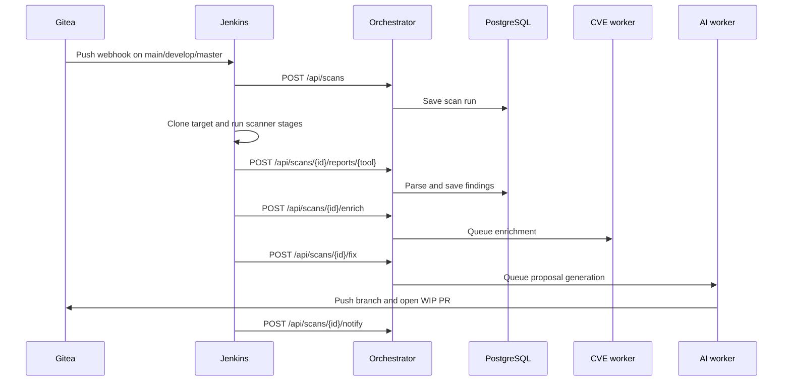

# Architecture and repository guide

This guide describes the code currently in this repository. `VigilentOps` is the repository name; `SecureGuard` and `sg-` remain in service names, database models, and API labels.

## Services

| Compose service | Code or configuration | Responsibility |
| --- | --- | --- |
| `gitea` | `docker-compose.yml` | Git hosting and pull requests |
| `postgres`, `redis`, `migrate` | `ai-engine/migrations/`, `ai-engine/migrate.py` | Persistent records, Celery queue, ordered schema migration |
| `orchestrator` | `ai-engine/main.py`, `report_parsers.py`, `db.py` | Scan API, report ingestion, findings, metrics, notifications |
| `celery-worker` | `ai-engine/tasks.py`, `fix_engine.py`, `fix_validation.py` | Generate and push reviewable remediation proposals |
| `cve-intel`, `cve-worker` | `cve-intel/poller.py`, `tasks.py` | CVE lookup and asynchronous enrichment |
| `dashboard` | `dashboard/src/`, `dashboard/Dockerfile` | React scan UI; Nginx proxies `/api` and `/cve-intel/` internally |
| `jenkins` (`ci` profile) | `jenkins/pipelines/Jenkinsfile` | Scanner pipeline and report upload |
| `gitea-runner` (`actions` profile) | `docker-compose.yml` | Optional Gitea Actions runner, separate from Jenkins |
| `prometheus`, `grafana`, `falco`, `wazuh`, `loki`, `promtail`, exporters, `wazuh-proxy` (`monitoring` profile) | `monitoring/`, `wazuh-proxy/` | Metrics, logs, runtime events, Wazuh API access |

The Compose network is `sg-net`. The orchestrator, CVE service, dashboard, Gitea, and pushgateway are in the base stack. Jenkins, monitoring, and the Gitea Actions runner require their respective profiles. PostgreSQL, Redis, and Grafana data use named volumes. The `migrate` service runs before the application services and records applied SQL files in `schema_migrations`.

## Scan and remediation data flow

The `/api/scans/{id}/enrich` and `/fix` endpoints **queue** work; their HTTP responses do not prove the workers completed successfully. Jenkins completes its pipeline independently of the AI PR. The direct `/webhook/gitea` API route checks a Gitea signature and acknowledges the event; the Jenkins webhook is what starts the scanner pipeline.

Report upload parses Bandit JSON when the tool name is `bandit`, and SARIF when the JSON contains `runs`. A report can be uploaded while contributing zero parsed findings. The database stores scan runs, findings, CVE data, and alert records. The dashboard reads scans from the orchestrator; Grafana reads metrics and configured data sources.

## AI proposal boundary

The current SQL filter in `ai-engine/fix_engine.py` selects findings with `finding_class='sast'`, severity `MEDIUM`, `HIGH`, or `CRITICAL`, `fix_status='open'`, and a `.py` file path. It does not generate dependency upgrades or fixes for every scanner finding. The worker clones an allowed Gitea host, resolves each file path, calls configured models in fallback order, checks generated content, and writes changed files to `secureguard/scan-<id>-fixes`. It then creates a `WIP:` PR against `main`.

The file validation checks syntax and some structural limits. It cannot prove that the code fixes the finding, preserves service behavior, or passes integration tests. After opening a PR, the worker posts a numbered set of comments containing all stored findings for that scan, grouped by scanner; only findings linked to changed files are marked as having a proposed change. Raw code snippets and descriptions likely to contain credentials are omitted. The PR body states how many comment parts to expect. A comment failure leaves the task result `partial`, and reviewers should not treat an incomplete conversation as a finished report. `pr_opened` in the database means a proposal exists for a changed file; it is not a resolved finding. Follow [AI pull request review](AI_PR_REVIEW.md) before changing PR status or merging.

## Where to make changes

- Scanner stages and upload behavior: `jenkins/pipelines/Jenkinsfile`. The
  shared Jenkins job loads this file from `VigilentOps/main` for every hooked
  target repository. Its Semgrep stage mounts the central rules from
  `scanners/semgrep-rules/` for every scan.
- Report format, severity, and finding class mapping: `ai-engine/report_parsers.py`.
- Scan API and authentication: `ai-engine/main.py`.
- AI eligibility, prompting, validation, and PR creation: `ai-engine/fix_engine.py`, `fix_prompts.py`, `fix_validation.py`.
- Schema changes: add a numbered SQL file in `ai-engine/migrations/`; do not edit an applied migration for an existing volume.
- CVE matching: `cve-intel/poller.py` and `nvd_parser.py`.
- Dashboard pages and API calls: `dashboard/src/pages/` and `dashboard/src/api.js`.
- Monitoring provisioning: `monitoring/` and the corresponding services in `docker-compose.yml`.
