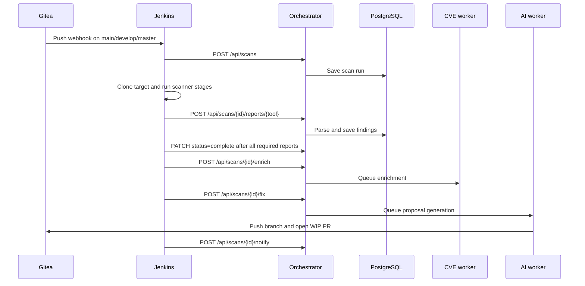

# Architecture and repository guide

This guide describes the code currently in this repository. `VigilentOps` is the repository name; `SecureGuard` and `sg-` remain in service names, database models, and API labels.

## Services

| Compose service | Code or configuration | Responsibility |
| --- | --- | --- |
| `gateway` | `proxy/nginx.conf` | HTTPS on port 3000; browser routes and dashboard/Prometheus authentication |
| `gitea` | `docker-compose.yml` | Git hosting and pull requests |
| `postgres`, `redis`, `migrate` | `ai-engine/migrations/`, `ai-engine/migrate.py` | Persistent records, Celery queue, ordered schema migration |
| `orchestrator` | `ai-engine/main.py`, `report_parsers.py`, `db.py` | Scan API, report ingestion, findings, metrics, notifications |
| `celery-worker` | `ai-engine/tasks.py`, `fix_engine.py`, `fix_validation.py` | Generate and push reviewable remediation proposals |
| `cve-intel`, `cve-worker` | `cve-intel/poller.py`, `tasks.py` | CVE lookup and asynchronous enrichment |
| `dashboard` | `dashboard/src/`, `dashboard/Dockerfile` | React scan UI; Nginx proxies `/api` and `/cve-intel/` internally |
| `jenkins` (`ci` profile) | `jenkins/pipelines/Jenkinsfile` | Scanner pipeline and report upload |
| `gitea-runner` (`actions` profile) | `docker-compose.yml` | Optional Gitea Actions runner, separate from Jenkins |
| `prometheus`, `grafana`, `falco`, `wazuh`, `loki`, `promtail`, exporters, `wazuh-proxy` (`monitoring` profile) | `monitoring/`, `wazuh-proxy/` | Metrics, logs, runtime events, Wazuh API access |

The Compose network is `sg-net`. The orchestrator, CVE service, dashboard, Gitea, and pushgateway are in the base stack. Jenkins, monitoring, and the Gitea Actions runner require their respective profiles. PostgreSQL, Redis, and Grafana data use named volumes. The `migrate` service runs before the application services and records applied SQL files in `schema_migrations`.

Only the gateway publishes a host port. Browser requests use HTTPS 3000:
Gitea at `/`, findings at `/dashboard/`, Jenkins at `/jenkins/`, Grafana at
`/grafana/`, and Prometheus at `/prometheus/`. Internal APIs, exporters,
agent listeners, and databases remain on the Docker network. See
[Gateway setup](GATEWAY.md) for authentication, TLS and migration details.

## Scan and remediation data flow

```mermaid
sequenceDiagram
    participant Git as Gitea
    participant CI as Jenkins
    participant API as Orchestrator
    participant DB as PostgreSQL
    participant CVE as CVE worker
    participant AI as AI worker
    Git->>CI: Push webhook on main/develop/master
    CI->>API: POST /api/scans
    API->>DB: Save scan run
    CI->>CI: Clone target and run scanner stages
    CI->>API: POST /api/scans/{id}/reports/{tool}
    API->>DB: Parse and save findings
    CI->>API: PATCH status=complete after all required reports
    CI->>API: POST /api/scans/{id}/enrich
    API->>CVE: Queue enrichment
    CI->>API: POST /api/scans/{id}/fix
    API->>AI: Queue proposal generation
    AI->>Git: Push branch and open WIP PR
    CI->>API: POST /api/scans/{id}/notify
```

The `/api/scans/{id}/enrich` and `/fix` endpoints **queue** work; their HTTP responses do not prove the workers completed successfully. Jenkins completes its pipeline independently of the AI PR. Accepted reports are finalized before enrichment and AI; a downstream workflow failure may fail Jenkins while the scan remains complete. Notification responses distinguish disabled channels, no high findings, successful delivery and delivery failure. External messages omit raw finding descriptions and source. The direct `/webhook/gitea` API route checks a Gitea signature and acknowledges the event; the Jenkins webhook is what starts the scanner pipeline.

Report upload validates Bandit JSON, SARIF 2.1.0, or Syft SPDX according to the tool name. Invalid shapes and unknown scan IDs are rejected; a valid report may still contain zero findings. Dockle SARIF is parsed into image-configuration findings. Syft supplies an SBOM inventory and does not create vulnerability records. The database stores scan runs, findings, CVE data, and alert records. The dashboard reads scans from the orchestrator; the coverage audit uses `GET /api/scans?summary_only=true` to avoid transferring every historical finding. Grafana reads metrics and configured data sources.

## AI proposal boundary

The current SQL filter in `ai-engine/fix_engine.py` selects findings with `finding_class='sast'`, severity `MEDIUM`, `HIGH`, or `CRITICAL`, `fix_status='open'`, and a `.py` file path. It does not generate dependency upgrades or fixes for every scanner finding. The worker validates the Gitea origin/path, uses temporary Git askpass credentials, resolves each file path, calls configured models in fallback order, and writes accepted candidates to `secureguard/scan-<id>-fixes`. It creates a `WIP:` PR against the scanned branch.

Validation checks syntax, structural limits and retention of Python class/function argument interfaces. For Bandit rules it rescans original/candidate text with suppression comments ignored, requires original rules to reproduce and disappear, and rejects increased medium/high results. This does not prove runtime behavior or integration correctness. After opening a PR, the worker posts numbered comments containing all stored findings, grouped by scanner, with report coverage and available artifact metadata. Secret-bearing details are omitted. Incomplete comment publication returns `partial` and leaves findings open. Only eligible SAST findings linked to changed files are marked `pr_opened` after complete publication; that status denotes a proposal, never a resolved issue. Follow [AI pull request review](AI_PR_REVIEW.md).

The worker verifies the target checkout matches the scan commit before proposing changes. It handles provider rate limits with bounded retries and a deferred Celery task, then tries configured fallback models. It rejects unchanged, syntactically invalid, or heavily shortened model output. See [AI rate limits and patch quality](AI_RATE_LIMITS_AND_QUALITY.md) for operations and limits.

## Where to make changes

- Scanner stages and upload behavior: `jenkins/pipelines/Jenkinsfile`. The
  shared Jenkins job loads this file from `VigilentOps/main` for every hooked
  target repository. Its Semgrep stage mounts the central rules from
  `scanners/semgrep-rules/` for every scan.
- Report format, severity, and finding class mapping: `ai-engine/report_parsers.py`.
- Scan API and authentication: `ai-engine/main.py`.
- AI eligibility, prompting, validation, and PR creation: `ai-engine/fix_engine.py`, `fix_prompts.py`, `fix_validation.py`.
- Schema changes: add a numbered SQL file in `ai-engine/migrations/`; do not edit an applied migration for an existing volume.
- CVE matching: `cve-intel/poller.py` and `nvd_parser.py`.
- Dashboard pages and API calls: `dashboard/src/pages/` and `dashboard/src/api.js`.
- Monitoring provisioning: `monitoring/` and the corresponding services in `docker-compose.yml`.

## Report and artifact records

Migrations 002/003 add optional finding package/version/image fields, the
required tool set and shared pipeline commit on each scan, and `scan_reports`
receipts keyed by scan/tool. Receipts include SHA-256, result count and coverage.
The API locks the scan during upload, accepts identical retries without
creating duplicate findings, rejects conflicting reports and refuses completion
when required receipts are missing. Zero findings and OSV `not_applicable`
remain distinct. Historical scans have no retroactive receipts or inferred
artifact metadata. A complete scan does not mean its vulnerabilities are fixed.

The canonical shared Jenkinsfile supports administrator PR-head review mode;
ordinary hooks still accept only main/develop/master. The legacy alternate
Groovy pipeline fails with a migration instruction. Prepared native Jenkins
security uses private bootstrap settings and separate admin/metrics permissions;
see [Next server session](NEXT_SERVER_SESSION.md) for deployment order.

## Dockerfile and shell lint

The shared pipeline discovers applicable files in its clean target checkout,
then runs Hadolint and ShellCheck in isolated, read-only, network-disabled
containers. The adapter converts their native JSON into SARIF and records the
selected file count and scanner image. Both are required reports, even when
file discovery returns zero. The API stores them as `quality` findings;
whole-scan PR conversations include them, while automated remediation remains
limited to eligible Python SAST findings. See [Scanner coverage](SCANNERS.md).
Before scanners run, a read-only Docker bind probe verifies that the host
mount's Git commit matches the Jenkins checkout. A mismatch fails the build.
